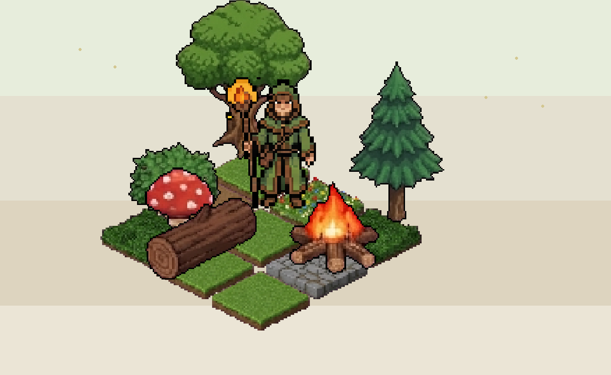
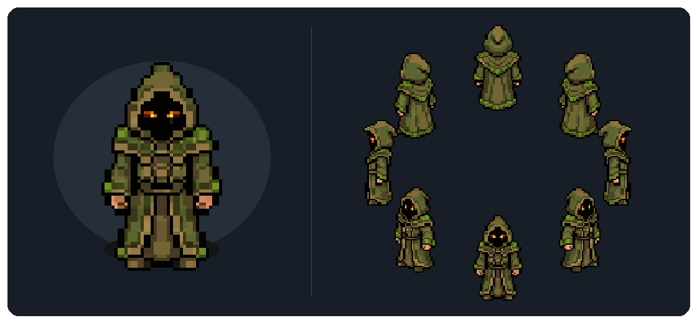
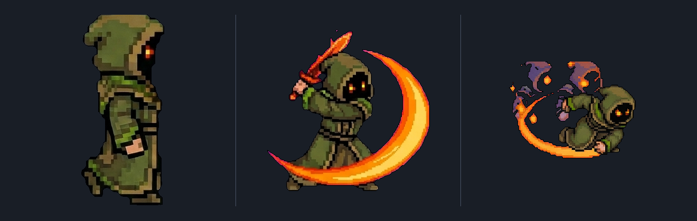
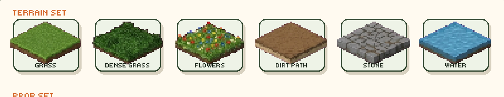
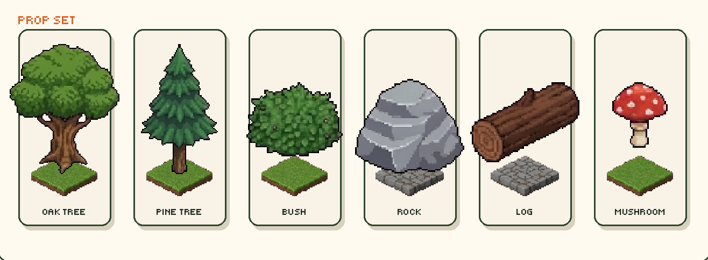
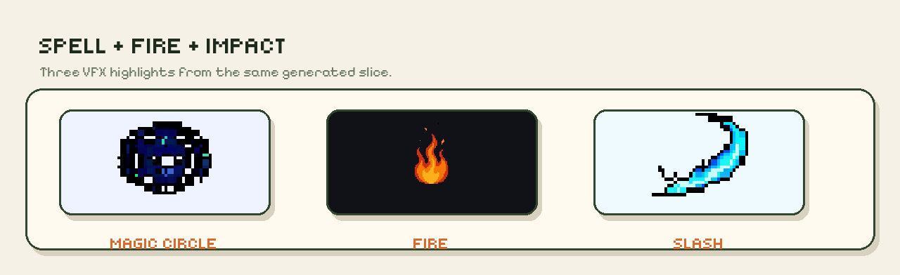

<p align="center">
  
</p>

<h3 align="center">AI-powered pixel art generation for games</h3>

<p align="center">
  Describe what you want. Get back game-ready sprites.<br/>
  Characters, animations, terrain, objects, and VFX — all from text prompts.
</p>

<p align="center">
  <a href="#installation">Install</a> •
  <a href="#quick-start">Quick Start</a> •
  <a href="#usage">Usage</a> •
  <a href="docs/cli.md">CLI Reference</a> •
  <a href="docs/process.md">How It Works</a>
</p>

---

## Showcase

### Characters

Generate multi-view isometric character sheets from a text description. Each character comes out consistent across all angles — ready to drop into a game.

<p align="center">
  
</p>

### Animations

Take any generated character and produce animation cycles — walk, idle, attack, cast, run, dodge, and more. Frames stay consistent with the original sprite.

<p align="center">
  
</p>

### Terrain Tiles

Isometric terrain tilesets that tile seamlessly. Generate variants of a single material, or use themed presets to get a full set in one go — forest, dungeon, desert, or winter.

<p align="center">
  
</p>

### World Objects

Props and scenery for your world — trees, rocks, chests, torches, campfires. Generate them individually or grab a preset pack. Objects can be animated too (swaying trees, flickering torches, opening chests).

<p align="center">
  
</p>

### VFX Effects

Standalone visual effects — explosions, fire, healing auras, magic circles, poison clouds. One-shot or looping, with automatic loop closure so the last frame matches the first.

<p align="center">
  
</p>

---

## Features

- **Canvas-guided generation** — every command builds a template canvas with labeled guides, so Gemini knows exactly where to paint. A cleanup pass removes the guides automatically.

- **Clean sprite extraction** — connected-component analysis separates individual sprites from the sheet. Background removal, mask cleanup, and uniform 1px outlines are applied automatically.

- **Pixel-perfect resizing** — pass `--sizes 32,64,128` to get true pixel art at any resolution. Uses grid detection (Canny + Hough) to find the real pixel grid, not naive downscaling.

- **Built-in presets** — terrain themes (`forest`, `dungeon`, `desert`, `winter`), object sets (`village`, `camp`, and more), and effect packs (`combat`, `magic`, `nature`, `status`). Or define your own custom sets.

- **Structured JSON prompts** — all prompts are Jinja2 JSON templates, easy to read and tweak without touching code.

---

## Installation

**Requirements:** Python 3.12+ and [uv](https://docs.astral.sh/uv/)

```bash
git clone https://github.com/BedirT/pixel-magic.git
cd pixel-magic
uv sync
```

Create a `.env` file with your [Google AI API key](https://aistudio.google.com/apikey):

```env
GOOGLE_API_KEY=your_key_here
```

---

## Quick Start

Generate a character:

```bash
pixel-magic generate \
  --name knight \
  --description "medieval knight with silver armor, blue cape, and a longsword"
```

Animate it:

```bash
pixel-magic animate --name knight --animation walk --frames 6
```

Your sprites land in `output/knight/` — individual views in `views/`, animation frames in `animations/walk/`.

---

## Usage

### `generate` — Character Sheets

Multi-view isometric characters. Supports 4 or 8 directions, configurable platform size for large creatures.

```bash
pixel-magic generate --name <name> --description "<description>" [options]
```

Key options: `--directions {4,8}`, `--tiles {1,4,9}`, `--style`, `--sizes`, `--no-platform`

### `animate` — Character Animations

Animation frames for existing characters. 10 built-in animation types: `walk`, `idle`, `attack`, `run`, `cast`, `hurt`, `death`, `dodge`, `jump`, `block`.

```bash
pixel-magic animate --name <name> --animation <type> [options]
```

Key options: `--frames`, `--loop/--no-loop`, `--direction`, `--reference`

### `tile` — Terrain Tiles

Isometric terrain with seamless tiling. Generate variants of a single type or a full themed set.

```bash
pixel-magic tile (--type <material> | --theme <theme>) [options]
```

Themes: `forest` · `dungeon` · `desert` · `winter` · `custom`

### `object` — World Objects

Props and scenery on labeled platforms. Single objects with variants or preset packs.

```bash
pixel-magic object (--name <name> | --preset <preset>) [options]
```

Presets: `forest` · `dungeon` · `village` · `camp` · `desert` · `winter` · `custom`

### `animate-object` — Object Animations

Animation frames for existing objects. Sway, flicker, burn, pulse, open, bob, spin.

```bash
pixel-magic animate-object --set <set> --name <object> [options]
```

### `effect` — VFX Effects

Standalone visual effects — one-shot or looping, single effects or preset packs.

```bash
pixel-magic effect (--name <effect> | --preset <preset>) [options]
```

Presets: `combat` · `magic` · `nature` · `status` · `custom`

---

For the full list of flags and output details, see the **[CLI Reference](docs/cli.md)**.

---

## Configuration

All settings come from `.env` and can be overridden by CLI flags.

| Variable | Default | Description |
|----------|---------|-------------|
| `GOOGLE_API_KEY` | *(required)* | Google AI API key |
| `PIXEL_MAGIC_GEMINI_IMAGE_MODEL` | `gemini-3.1-flash-image-preview` | Gemini model |
| `PIXEL_MAGIC_CHROMAKEY_COLOR` | `green` | Background color for removal |
| `PIXEL_MAGIC_MAX_COLORS` | `16` | Default color limit |
| `PIXEL_MAGIC_OUTPUT_DIR` | `output` | Output directory |

---

## License

MIT
