# Pixel Magic

AI-powered pixel art asset generation CLI. Feed it a description, get back game-ready sprites — characters, animations, terrain tiles, world objects, and VFX effects.

Built on Google Gemini's image generation with a canvas-based pipeline that guides the AI using template layouts, then cleans and extracts individual sprites automatically.

## Showcase: Ember Depths

<p align="center">
  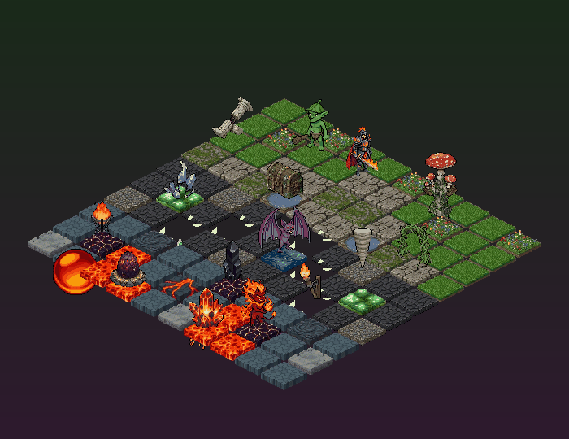
</p>

Every asset above was generated with a single `pixel-magic` command. This is a fictional roguelike dungeon crawler spanning three biomes — [full showcase details](showcase/README.md) | [live demo](showcase/index.html).

### Characters

<table>
<tr>
<td align="center">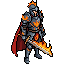<br><b>Ember Knight</b></td>
<td align="center">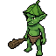<br><b>Forest Goblin</b></td>
<td align="center">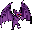<br><b>Cave Bat</b></td>
<td align="center"><br><b>Fire Imp</b></td>
<td align="center"><br><b>Lava Dragon</b></td>
</tr>
</table>

### Animations

Walk, idle, and attack cycles for the Ember Knight:

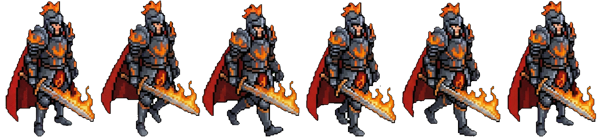
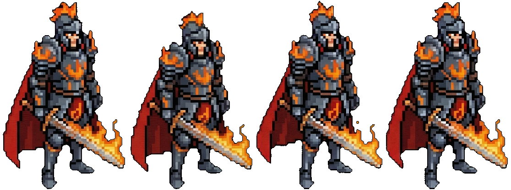
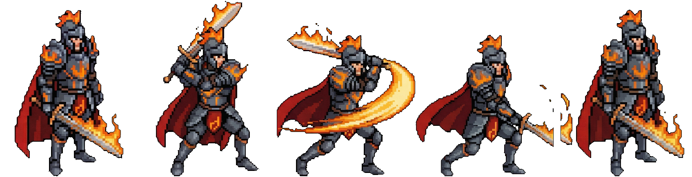

### Terrain Tiles

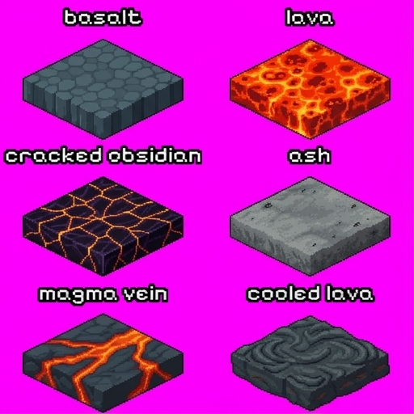

### World Objects

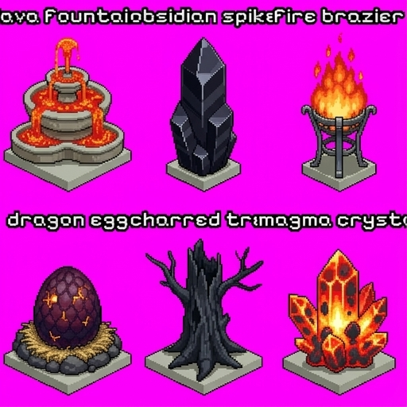

### VFX Effects

<table>
<tr>
<td align="center">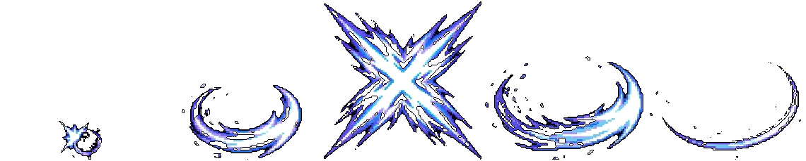<br>Sword Slash</td>
<td align="center">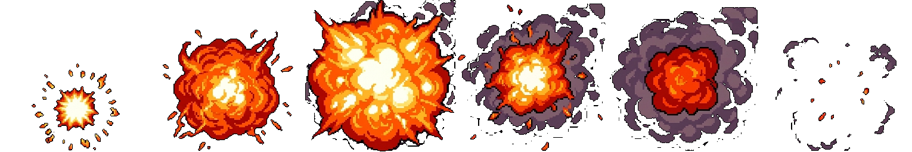<br>Fire Explosion</td>
</tr>
<tr>
<td align="center"><br>Magic Shield</td>
<td align="center">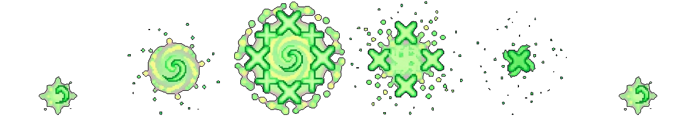<br>Healing Glow</td>
</tr>
</table>

## Quick Start

```bash
git clone https://github.com/BedirT/pixel-magic.git
cd pixel-magic
uv sync
cp .env.example .env
# set GOOGLE_API_KEY in .env
```

## Commands

| Command | What it makes | Example |
|---------|--------------|---------|
| `generate` | Multi-view character sheets | `pixel-magic generate --name knight --description "medieval knight"` |
| `animate` | Character animation frames | `pixel-magic animate --name knight --animation walk --frames 6` |
| `animate-object` | Object animation frames | `pixel-magic animate-object --set forest --name oak_tree --animation sway` |
| `tile` | Terrain tilesets | `pixel-magic tile --theme forest --sizes 32,64` |
| `object` | World objects/props | `pixel-magic object --preset village` |
| `effect` | VFX animations | `pixel-magic effect --preset combat` |

## How It Works

All commands follow a canvas-based pipeline:

1. **Template** — Build a canvas with labeled guides (platforms, wireframes, numbered slots)
2. **Generate** — Gemini fills in the content guided by structured JSON prompts
3. **Clean** — A second pass removes guide artifacts
4. **Extract** — Individual sprites are cut from the sheet with background removal, mask cleanup, and outline normalization

Prompts are Jinja2 JSON templates in [`src/pixel_magic/prompts/templates/`](src/pixel_magic/prompts/templates/) — easy to read, edit, and iterate on independently from code.

## Docs

- [CLI reference](docs/cli.md) — all commands, arguments, presets, output structure
- [Process overview](docs/process.md) — detailed pipeline walkthrough
- [Project state](STATE.md) — what works, limitations, architecture decisions
- [Showcase commands](showcase/COMMANDS.md) — every CLI invocation used for the Ember Depths demo

## License

MIT
