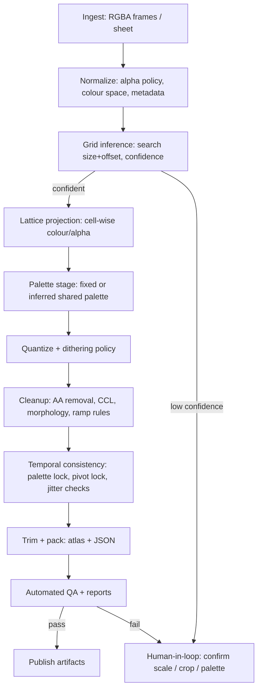
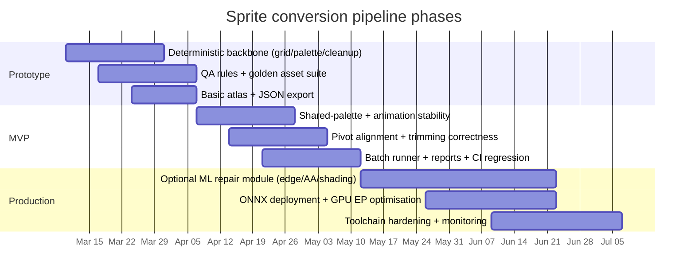

# Automated Conversion of Imperfect “Pixel-Style” Images into Production-Quality Sprite Assets

## Executive summary

An automated pipeline to turn AI-generated or otherwise “not-quite-pixel-perfect” images into production-ready pixel sprites is feasible, but only under an explicit **asset contract**: an inferred or specified pixel grid, a hard stance on transparency, and an enforced palette and per-frame consistency rules. The core difficulty is that many “pixel-style” images are not actually discrete lattice art; they contain anti-aliasing, subpixel offsets, blur, compression ringing, inconsistent shading ramps, and palette drift—problems that have to be corrected or rationalized into discrete decisions. Research and tooling both reinforce that pixel art is unusually sensitive to per-pixel decisions and local ambiguities, and conventional image models can struggle because they aggregate neighbourhood pixels rather than targeting single-pixel intent. citeturn23view0turn25view1

A best-in-industry design is **hybrid**:

- A deterministic, auditable “grid → palette → cleanup → consistency → export” backbone (high reliability, debuggable outputs, easy QA gates).
- Optional learning-based modules used only where heuristics break: repairing badly anti-aliased edges, normalizing shading, and enforcing temporal coherence. Pixel-art-specific representation work (discrete embeddings aligned with pixel patches) and constrained quantized generation methods point to effective strategies: learn or optimize in a discrete/quantized space rather than trying to “pixelate” after the fact. citeturn23view0turn22view0

For animation, strict **shared palette** and **pivot/anchor stability** are non-negotiable; otherwise flicker and jitter dominate. Optical-flow-based alignment and temporal consistency losses are standard mechanisms to reduce frame-to-frame artifacts in video-like pipelines, and they apply directly to sprite sequences. citeturn11search0turn11search17

## Problem definition and failure modes

### What “conversion” means in production terms

The production goal is not “make it look pixelated.” The goal is to output sprite assets that satisfy engine- and art-team constraints:

- **Discrete pixel lattice**: colours are piecewise-constant on the intended grid; no unintended intermediate colours.
- **Controlled colour vocabulary**: either a fixed palette (game/style palette) or a stable generated palette that is consistent across frames and variants.
- **Binary or policy-driven alpha**: transparent pixels and solid pixels behave predictably; no semi-transparent anti-alias halos unless explicitly allowed.
- **Animation coherence**: stable silhouette, stable palette indices, stable anchor/pivot, stable timing metadata.

This is difficult because pixel art’s semantics are concentrated at the pixel scale—single pixels can define features—and local configurations (especially diagonals) can be ambiguous in intent. That ambiguity is a known theme in classical pixel-art processing and vectorization research, where connectivity and diagonal interpretation must be resolved explicitly. citeturn25view0turn25view1

### Common failure modes you must plan for

**Grid and scale ambiguity**
- The source may be a high-res “pixel-looking” render with no true macro-pixel size, or multiple plausible sizes (e.g., 4× vs 5× “pixels”), making the target lattice underdetermined.

**Subpixel misalignment and micro-rotation**
- AI outputs can introduce slight rotation/shear or fractional offsets; naive downsampling then produces crawling edges and inconsistent outlines.

**Anti-aliasing and semi-transparent halos**
- Edges often contain intermediate colours and/or semi-transparent pixels, which will either explode palette size or produce noisy quantization. In sprite workflows, alpha is often used as a mask; evidence from sprite GAN work shows retaining an explicit alpha channel can improve shape fidelity and reduce “dangling pixels” outside silhouettes. citeturn24view1

**Palette drift and gradient pollution**
- Even if frames look consistent perceptually, naive per-frame quantization yields different palette indices per frame, producing flicker; dithering can amplify this if not constrained.

**Connected-component noise**
- One-pixel islands, holes, and detached clusters appear after quantization or edge cleanup; they must be removed with morphological/CCL rules.

**Metadata breakage in trimming/packing**
- Trimming transparent borders without preserving offsets shifts sprites in-engine; production formats typically require both the trimmed rectangle and its placement within the original untrimmed frame rectangle. Formats in common engines and loaders represent this with fields like `frame`, `spriteSourceSize`, and `sourceSize` (and sometimes an `anchor`/pivot). citeturn14search1

## Inputs and asset contract

### Required inputs (minimum viable)

- **RGBA images** (single sprite, sprite sheet, or frame sequence). If alpha is missing, a background key colour or mask policy must be applied.
- **Target outputs**: one or more of
  - per-frame PNGs,
  - an atlas PNG,
  - a metadata JSON describing frame rectangles, trims, pivots/anchors, and durations.

### Optional but high-leverage inputs (turn uncertain inference into deterministic output)

- Intended **pixel scale** (macro-pixel size) or target **sprite resolution** (e.g., 32×32, 64×64).
- Intended **palette** (a fixed list of colours) or a palette selection policy (e.g., “max 16 colours, include transparency, preserve brand colours”).
- Animation semantics: frame order, tags/clips, durations.
- Anchor/pivot policy: centre, feet contact, or explicit points.

### Open-ended handling when unspecified

If the palette and scale are unspecified, you need an inference policy and output contract that remains stable:

- Palette inference must support both **single-image** and **multi-frame** estimation; multi-frame requires a shared palette generation step (histogram across frames, then remap each frame). Libraries designed for palette quantization support multi-image palette creation explicitly. citeturn4search8turn1search13
- Scale inference must output both (a) the chosen macro-pixel size and (b) a confidence score to gate automation vs human review.

### Canonical internal metadata model

A practical internal representation is “TexturePacker/Pixi-style” JSON because it encodes trimming correctly and is widely consumable. Typical fields include:

- `frame`: atlas rectangle
- `spriteSourceSize`: rectangle of the trimmed sprite within its original canvas
- `sourceSize`: original untrimmed size
- `anchor`/pivot: where the engine should position the sprite in world space (format-dependent) citeturn14search1turn2view2

## Deterministic pipeline design

A best-in-class deterministic backbone treats the job as **inference + projection + enforcement**: infer the lattice, then project pixels onto it, then enforce constraints (palette/alpha/consistency).

image_group{"layout":"carousel","aspect_ratio":"16:9","query":["pixel art sprite sheet atlas example","texture atlas packing trimming padding diagram","ordered dithering pixel art example","floyd steinberg dithering example"],"num_per_query":1}

### Ingest and normalize

1. **Decode to a working representation**
   - Preserve alpha as a first-class channel; avoid implicit premultiplication surprises.
   - Normalize colour space handling: palette work is usually done in display space, but distance computations benefit from perceptual spaces (below).

2. **Alpha policy upfront**
   - If sprite alpha is intended to be binary, threshold early and treat semi-transparent pixels as an artifact class to be removed or snapped.
   - Empirically, explicit alpha can improve silhouette learning and reduce outside-silhouette noise in sprite generation contexts. citeturn24view1

### Grid (macro-pixel) inference and alignment

A robust approach is **search + score**:

- Enumerate candidate integer macro-pixel sizes `s ∈ [2..32]` (or wider if needed), plus candidate subcell offsets `(ox, oy)`.
- For each candidate:
  - Project the source onto a lattice of size `s` (cell aggregation, not generic resize).
  - Reconstruct back to source scale with nearest-neighbour replication.
  - Score with a loss emphasizing edges and flat regions (gradient-weighted error) and penalizing intra-cell variance (cells should be constant).

This design aligns with the fact that naive resampling choices matter: area-based interpolation is commonly recommended for shrinking images in standard CV libraries, but for pixel-art projection you often want **cell-wise robust estimators** (mode/median) rather than pure averaging, because averaging manufactures colours you later have to quantize away. Guidance on interpolation choice for shrinking vs enlarging (area vs linear/cubic) in common libraries helps justify these tradeoffs. citeturn1search5turn1search23

If the source is slightly rotated/sheared, correct it before projection:

- Estimate dominant axis via edge orientation statistics or line detection.
- Apply a small affine correction and re-run grid scoring.
- Any non-orthogonal transform should be heavily penalized unless evidence is strong, because it increases ambiguity at the pixel lattice. citeturn3search1turn25view1

### Lattice projection and downsampling

Once `s, ox, oy` are chosen:

- For each macro-cell, compute:
  - **Colour**: median/medoid in a perceptual space (Lab/OKLab) for robustness against edge anti-alias pixels.
  - **Alpha**: majority vote or thresholded average, depending on policy.

Using OKLab (and related OKLCH) as a perceptual working space is common in modern colour workflows because it is designed for improved perceptual behaviour over classic Lab in many practical tasks. citeturn9search0turn9search3

### Palette selection and quantization

There are three operating modes:

1. **Fixed palette (preferred for production)**
   - Map each projected pixel to the nearest palette colour (distance in OKLab/Lab; optionally use ΔE-like distances for better weighting).
   - Enforce exact membership: every output pixel must be an index in the palette.

2. **Adaptive palette (single sprite)**
   - Choose `K` colours (K-means or median-cut family), then remap.
   - K-means-based colour quantization is a standard baseline and widely documented in CV tooling. citeturn5search1turn5search19

3. **Shared palette (multi-frame animation)**
   - Build a histogram or aggregate colour stats across all frames, generate one palette, then remap every frame to it.
   - Palette quantization libraries explicitly support multi-image palette optimisation and controlled dithering during remapping. citeturn4search8turn1search13

### Dithering strategy

Dithering is not inherently “good” for sprites. It is a controlled trade:

- **No dithering**: cleanest, most stable for animation; can band gradients.
- **Ordered dithering**: stable pattern (reduced temporal shimmer), but introduces visible texture. citeturn4search19
- **Error diffusion (Floyd–Steinberg variants)**: can look better per-frame but often flickers across frames because the diffusion depends on scan order and local context; some quantization libraries use adaptive variants and expose a dithering strength parameter. citeturn1search13turn1search1

For animation pipelines: ordered dithering or no dithering is usually easier to make temporally stable than error diffusion.

### Edge/outline detection and anti-alias removal

After quantization:

- Detect edge candidates (outline and high-contrast boundaries).
  - Classic multi-stage edge detectors are widely used and documented; they are sensitive to noise, so operate in the already-quantized space or after mild smoothing in a controlled way. citeturn7search3
- Snap edge-adjacent pixels to reduce unintended subpixel anti-alias ramps:
  - For every edge pixel, evaluate its neighbourhood and collapse 1-pixel “intermediate colours” that are not in an allowed ramp.

### Connected component cleanup and morphology

Run deterministic repair passes:

- **Connected components labeling** to find and remove tiny islands, enforce minimum component sizes, and detect holes. Connected-components functions are explicit primitives in major CV APIs. citeturn7search5turn7search1
- **Morphological operations** (opening/closing, hole filling) on binary masks (alpha, outlines) to repair cracks and remove speckle; modern image toolkits provide these operations with clear semantics. citeturn7search2turn7search6

### Shading-ramp enforcement (pixel-art style rule layer)

This layer enforces constraints that are not purely geometric:

- Limit per-sprite ramp count (e.g., 2–4 ramps per material).
- Enforce monotonic lightness within a ramp and constrain hue drift.
- Collapse “near-duplicate” colours that arise from anti-alias residue.

This is rule-heavy but pays off because it removes many “AI-ish” artifacts (random banding, inconsistent highlight colours) without any learned model.

### Seam and frame consistency

For frame sequences:

- Enforce a **single palette** and stable index mapping across all frames (shared palette mode).
- Compute a canonical **pivot** per animation clip (e.g., feet contact point) and force all frames to align to that pivot.
- Detect jitter:
  - silhouette centroid drift,
  - bounding-box drift (after trimming),
  - outline thickness variance.

Optical flow can serve as a correspondence prior for temporal losses and stabilisation; RAFT is a standard modern optical-flow method used as a building block in temporal consistency pipelines. citeturn11search0turn11search17

### Trimming, packing, and metadata export

Trimming is mandatory for atlas efficiency but must be paired with correct offsets:

- Output both trimmed rectangles and original canvas sizes (`sourceSize`) and offsets (`spriteSourceSize`)—this is exactly why common sprite formats include these fields. citeturn14search1turn12search28
- Include `duration` per frame and an anchor/pivot representation compatible with your target engines/loaders. citeturn14search1turn12search15
- Atlas packers and exporters typically also support pivot points, trimming and metadata export, which should be treated as part of the production contract rather than optional conveniences. citeturn2view2

## Learning-based approaches

Deterministic projection works well when the image is “close” to real pixel art. Learning-based modules become justified when you must repair ambiguous or heavily corrupted inputs.

### Supervised sprite-to-sprite translation models

For tasks like “convert front-facing to right-facing” or “repair sprite silhouette,” conditional GAN-style image-to-image systems remain relevant. A pixel-art sprite generation study based on Pix2Pix reports:

- improvements from explicitly modelling RGBA (alpha as redundant but useful shape signal),
- persistent issues of high-frequency colour noise under limited data,
- evaluation with FID plus visual inspection. citeturn24view0turn24view1turn10search2

These findings generalize to “repair” stages: alpha-aware modelling and strong post-quantization constraints are often required to make outputs usable.

### Discrete-latent representations tailored to pixel art

Pixel-art-specific representation learning argues that standard CNN processing of neighbourhood clumps makes it hard to target individual pixels precisely; they propose VQ-VAE-style discrete embeddings aligned with pixel patches and show improved reconstructions/metrics on pixel-art data. citeturn23view0turn23view1

Pipeline implication: if you train a correction model, train it to predict **palette indices / discrete codes**, not RGB values, so the model cannot “invent” off-palette colours.

### Constrained quantized generation and optimisation-based methods

A different route is to treat conversion as constrained optimisation in a quantized space. SD-πXL is an example of explicitly generating low-resolution quantized images under hard constraints (size and palette) via differentiable generation and score distillation, including mechanisms (e.g., Gumbel-softmax) aimed at crisp discrete outputs and optional spatial conditioning. citeturn22view0turn21view0

Pipeline implication: if your input is severely “non-pixel,” it can be more robust to **re-synthesise** a quantized sprite under constraints than to denoise+downsample.

### Temporal consistency models and losses for animated sprites

Video style transfer and restoration commonly use temporal losses based on optical flow to reduce flicker; this directly applies to sprite frames (treat clips as short videos). citeturn11search17turn11search0

A practical training loss stack for animated sprite correction:

- **Discrete palette loss**: cross-entropy over palette index per pixel (or Gumbel-softmax relaxation).
- **Edge loss**: penalize deviation of edge masks between output and target (or between adjacent frames after warping).
- **Warp consistency loss**: `L1(out_t, warp(out_{t-1}, flow_{t-1→t}))`.
- **Component regularizers**: penalties for isolated islands / holes (computed differentiably or as post-pass QA gates).

### Synthetic data generation for training

Because real labelled “imperfect pixel-style → ground-truth pixel art” pairs are scarce, synthetic degradation is the default:

- Start from curated pixel art sprites (licensed/internal).
- Apply degradations: non-integer scaling, blur, JPEG compression, colour jitter, alpha feathering, outline smearing, and palette drift.
- Train correction models to recover the original discrete sprite.

This mirrors the broader practice of training restoration models on synthetic degradations when real paired data is limited. citeturn8search0turn23view0

## Implementation architecture and operations

### Tooling and libraries to prioritize

| Role in the pipeline | Candidate tool/library | Why it matters in production |
|---|---|---|
| Deterministic CV primitives (resize, warps, CCL) | entity["organization","OpenCV","computer vision library"] | Strong baseline for geometric transforms and connected components; widely deployed; clear semantics for shrink/resize guidance. citeturn7search5turn1search5 |
| Deterministic morphology + measurement | entity["organization","scikit-image","python image processing"] | High-quality morphology and labeling primitives for cleanup and QA metrics. citeturn7search2turn7search4 |
| Lightweight image decoding/IO | entity["organization","Pillow","python imaging library"] | Simple decode/encode and format handling; useful at boundaries. citeturn3search20 |
| High-throughput batch image processing | entity["organization","libvips","fast image processing"] | Designed for speed and low memory in large batch transform workloads. citeturn3search3turn3search11 |
| Palette quantization + dithering | entity["organization","libimagequant","palette quantization library"] | High-quality palette generation; supports controlled dithering; supports multi-image palette workflows. citeturn1search13turn4search8 |
| CLI quantization in batch | entity["organization","pngquant","png palette quantizer"] | Production-friendly CLI for RGBA→indexed palette PNG with adjustable dithering/quality. citeturn1search1turn1search7 |
| Sprite authoring + batch exports | entity["organization","Aseprite","pixel art editor"] | CLI exports textures + JSON metadata (`--sheet`, `--data`, `--format`), plus colour-mode conversion and dithering options. citeturn2view0turn2view1 |
| Atlas packing + exporter ecosystem | entity["organization","TexturePacker","sprite sheet packer"] | Pivot points, trimming, many engine exporters, and custom exporter support. citeturn2view2turn12search24 |
| Widely consumed “frames JSON” schema | entity["organization","PixiJS","2d rendering engine"] | Explicit example JSON format with `frame`, `spriteSourceSize`, `sourceSize`, and `anchor`, useful as a canonical interchange. citeturn14search1turn14search27 |
| Open palette sources | entity["organization","Lospec","pixel art palette database"] | Palette database + API providing palette colour lists, useful for default palette strategies and tooling integration. citeturn4search3turn4search1 |
| Engine-side atlas conventions | entity["organization","LibGDX","java game framework"] | Practical naming/index conventions for animation packing and retrieval. citeturn12search0 |
| Engine import baseline | entity["organization","Godot Engine","game engine"] | Atlas importers and built-in atlas/region handling; useful compatibility target. citeturn12search7turn12search34 |
| Pivot semantics reference | entity["organization","Unity","game engine"] | Clear pivot definition and metadata fields for sprite atlases; useful compatibility target. citeturn12search15turn12search23 |
| Model deployment (portable inference) | entity["organization","ONNX Runtime","model inference runtime"] | Execution Provider (EP) abstraction supports CPU/GPU deployment in production. citeturn11search3turn11search7 |
| GPU acceleration + optimisation | entity["company","NVIDIA","gpu vendor"] + entity["organization","TensorRT","inference optimizer"] | A standard deployment route for optimised GPU inference through EPs, improving throughput/latency. citeturn11search11turn11search35 |

### Recommended modular architecture

A production pipeline benefits from strict module boundaries, intermediate artifacts, and deterministic “diffs” between stages.



Key design points this architecture enforces:

- **Gating on confidence** at grid inference prevents silent corruption of assets.
- **Shared palette generation** happens before dithering/cleanup for animations to reduce drift. citeturn1search13turn4search8
- **Trim + metadata** is treated as an export contract, not a cosmetic optimisation; correct offsets must be preserved for engine placement. citeturn14search1turn2view2

### Batch processing and performance

- Deterministic stages should be CPU-first and vectorized; large-batch transforms benefit from memory-efficient libraries designed for scaling pipelines. citeturn3search3turn3search11
- ML stages should be optional and isolated (repair-only), exportable to ONNX for production inference with CPU/GPU execution providers. citeturn11search3turn11search7
- For NVIDIA GPU deployments, TensorRT EP is a standard acceleration path and is explicitly supported in ONNX Runtime’s EP ecosystem. citeturn11search11turn11search35

### Example command-line workflows

```bash
# 1) Export frames + JSON from an .aseprite file (array JSON is easier to parse)
aseprite -b input.aseprite \
  --sheet out_sheet.png \
  --data out_sheet.json \
  --format json-array

# 2) Quantize to an indexed PNG with controlled dithering
pngquant --quality=70-95 --floyd=0.3 --force --output out_sheet_q.png out_sheet.png

# 3) Run your deterministic “sprite-clean” pipeline (example shape)
sprite_clean \
  --in out_sheet_q.png --meta out_sheet.json \
  --infer-grid --grid-range 2:16 \
  --alpha-policy binary --alpha-threshold 0.5 \
  --palette shared --max-colours 16 \
  --dither ordered --ordered-matrix bayer8 \
  --cleanup --remove-islands 2 --fill-holes 2 \
  --export-format pixi_json --out atlas/
```

The Aseprite CLI explicitly supports exporting textures plus JSON metadata and includes options for data formats and sheets in batch mode, enabling automated integration. citeturn2view0turn2view1
pngquant/libimagequant expose dithering control and are designed for RGBA-to-paletted outputs suitable for batch pipelines. citeturn1search1turn1search13

### Sample JSON metadata schema

This schema is intentionally close to commonly used “frames map” formats (TexturePacker/Pixi-like) so it remains easy to interop, while adding fields needed for production QA.

```json
{
  "meta": {
    "schema": "sprite-atlas-v1",
    "source": {
      "name": "input_asset_id",
      "content_hash": "sha256:..."
    },
    "image": "atlas.png",
    "size": { "w": 1024, "h": 1024 },
    "scale": "1",
    "pixel_grid": {
      "macro_size": 4,
      "offset": { "x": 1, "y": 0 },
      "confidence": 0.93
    },
    "palette": {
      "mode": "fixed|inferred_shared|inferred_per_sprite",
      "colors_rgba": ["#000000ff", "#ffffffff", "#ffcc00ff"],
      "max_colors": 16,
      "color_space": "oklab",
      "dither": { "type": "none|ordered|error_diffusion", "strength": 0.3 }
    },
    "alpha_policy": {
      "mode": "binary|keep8bit",
      "threshold": 0.5
    }
  },
  "frames": {
    "walk_right_000": {
      "frame": { "x": 12, "y": 34, "w": 32, "h": 32 },
      "rotated": false,
      "trimmed": true,
      "spriteSourceSize": { "x": 4, "y": 2, "w": 32, "h": 32 },
      "sourceSize": { "w": 40, "h": 40 },
      "pivot": { "x": 0.5, "y": 1.0 },
      "duration_ms": 80,
      "qa": {
        "palette_compliant": true,
        "alpha_compliant": true,
        "island_pixels_removed": 3
      }
    }
  },
  "animations": {
    "walk_right": ["walk_right_000", "walk_right_001", "walk_right_002"]
  }
}
```

The presence and meaning of `frame`, `spriteSourceSize`, `sourceSize`, and an anchor/pivot concept match the widely used sprite-sheet JSON conventions shown in PixiJS documentation and typical atlas exporters. citeturn14search1turn2view2

## Evaluation, QA, and roadmap

### Quantitative evaluation metrics

Use two layers: **hard conformance** and **perceptual/quality**.

**Hard conformance metrics (must-pass)**
- Palette compliance rate: % pixels ∈ palette.
- Alpha compliance rate: % pixels satisfy alpha policy (binary threshold or allowed alpha set).
- Grid compliance: intra-cell variance (should be 0 after projection).
- Component sanity: count of islands below size threshold; hole counts; silhouette connectivity.

These are directly computable with connected components and morphology primitives. citeturn7search5turn7search2

**Perceptual/quality metrics (compare candidates, tune ML)**
- SSIM for structural similarity (useful but can be brittle for pixel shifts). citeturn10search3
- LPIPS for perceptual distance aligned with human judgements in many settings. citeturn10search0turn10search36
- DISTS for combining structure and texture similarity with improved tolerance properties in some distortions. citeturn10search9turn10search29
- FID for distribution-level quality when evaluating generative modules or large sprite sets. citeturn10search2turn10search22

For sprite-specific evaluation, add:

- Temporal flicker score: mean absolute difference between consecutive frames after pivot alignment and/or flow warping.
- Palette-index stability: percentage of pixels that keep the same palette index after warping correspondences.

### Automated QA rules and failure-case taxonomy

Build a rule engine that emits labelled failures:

- `GRID_LOW_CONFIDENCE`
- `PALETTE_OVERFLOW` (palette > K or too many near-duplicates)
- `ALPHA_HALOS` (semi-transparent edge pixels detected under binary-alpha policy)
- `ISLAND_NOISE` (components under threshold)
- `TRIM_OFFSET_MISMATCH` (spriteSourceSize vs sourceSize inconsistent)
- `ANIM_FLICKER` (temporal jitter exceeds threshold)
- `PIVOT_DRIFT` (pivot changes > ε across frames)

This taxonomy becomes the backbone of regression testing and model/data iteration.

### Human-in-the-loop points

Use humans only where inference is underdetermined:

- Confirm macro-pixel size and offset when grid confidence is low.
- Approve/override palette selection when colour direction is ambiguous.
- Approve pivot policy for characters (feet vs centre) when no reliable contact point exists.

### Effort estimate and development roadmap

A realistic schedule separates deterministic backbone from ML upgrades.



**Scope-to-effort mapping (engineering estimate)**
- Prototype deterministic pipeline: 1–2 engineers, ~3–5 weeks (depends on how constrained your inputs are).
- MVP with animation stability + export correctness + QA: +4–6 weeks.
- Production-grade ML repair module (data synthesis + training + evaluation + deployment): +6–10 weeks, plus ongoing dataset/QA maintenance.

This sequencing matches known constraints in pixel-art generation research: limited real datasets, high sensitivity to pixel-level decisions, and the need for explicit constraints/representations rather than generic raster processing.