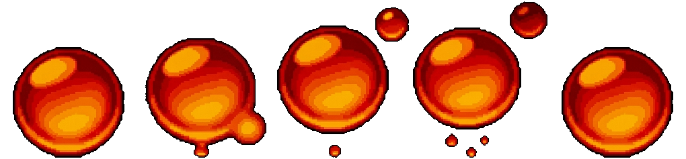
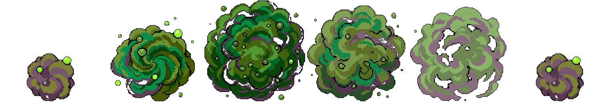

# Ember Depths

*A roguelike dungeon crawler where a lone knight descends through crumbling ruins, dark caverns, and volcanic depths to slay an ancient dragon.*

This showcase was built entirely with [pixel-magic](../README.md) to demonstrate every asset type the tool can generate. Every sprite, tile, object, and effect below was produced by a single CLI command backed by Google Gemini.

---

## Characters

| Character | Description | Sprite |
|-----------|-------------|--------|
| **Ember Knight** | The hero. Dark steel armor, flaming sword, red cape. |  |
| **Forest Goblin** | Small green goblin with wooden club and leaf hat. |  |
| **Cave Bat** | Large purple bat with glowing red eyes. |  |
| **Fire Imp** | Tiny red imp wreathed in flame. |  |
| **Lava Dragon** | Ancient red dragon with molten cracks (boss). |  |

### Animations

The Ember Knight has walk, idle, and attack animation cycles:

**Walk**

**Idle**

**Attack**

---

## The World

### Volcanic Tileset

### Volcanic Objects

---

## Effects

| Effect | Type | Preview |
|--------|------|---------|
| Sword Slash | One-shot |  |
| Fire Explosion | One-shot |  |
| Magic Shield | Looping |  |
| Healing Glow | Looping |  |
| Lava Bubble | Looping |  |
| Poison Cloud | Looping |  |

---

## Generation Cost

All 20 commands (5 characters + 3 animations + 3 tile themes + 3 object sets + 6 effects) completed in **~8 minutes** using `gemini-3.1-flash-image-preview`:

| Category | Commands | API Calls | Tokens | Time |
|----------|----------|-----------|--------|------|
| Characters (generate) | 5 | 10 | ~21,000 | ~165s |
| Animations (animate) | 3 | 6 | ~16,000 | ~163s |
| Tiles (tile) | 3 | 6 | ~11,100 | ~49s |
| Objects (object) | 3 | 6 | ~11,200 | ~51s |
| Effects (effect) | 6 | 12 | ~25,300 | ~211s |
| **Total** | **20** | **~40** | **~84,600** | **~640s** |

Each command makes 2 API calls (generate + cleanup pass). Full per-command breakdown in [`cost_report.json`](cost_report.json).

## Asset Coverage

| Command | Assets Generated | Count |
|---------|-----------------|-------|
| `generate` | Character sprite sheets (4-dir, multi-tile) | 5 |
| `animate` | Character animations (walk, idle, attack) | 3 |
| `tile` | Terrain tilesets (3 biomes x 6 types) | 18 |
| `object` | World objects (3 biomes x 6 objects) | 18 |
| `effect` | VFX effects (combat, magic, environmental) | 6 |
| **Total** | **339 PNG files** | |

See [COMMANDS.md](COMMANDS.md) for the exact CLI invocations used to generate every asset.

---

## Gaps Discovered

Things noticed during this showcase generation run:

- **Doubled output paths**: When `--output-dir` already contains a category subdirectory (e.g., `assets/tiles`), the CLI adds another `tiles/` inside, resulting in `tiles/tiles/custom/`. The output-dir should be the root, not per-category.
- **Tile overwrite on multiple custom themes**: Running `tile --theme custom` three times overwrites `custom/` since all share the same set name. Each custom run should get a unique directory name, or the user should pass `--type` with a set name.
- **Object overwrite same issue**: Three `object --preset custom` runs overwrite each other's output. Only the last (volcanic) set survives at full quality.
- **No built-in "hurt" or "death" animations**: The animation description library covers walk/idle/attack/run/cast but missing common RPG animations.
- **Dragon not particularly pixel-art**: The tiles=4 large sprite comes out more painterly than pixel-art at native resolution. The 64x64 resize helps but the source is quite detailed.
